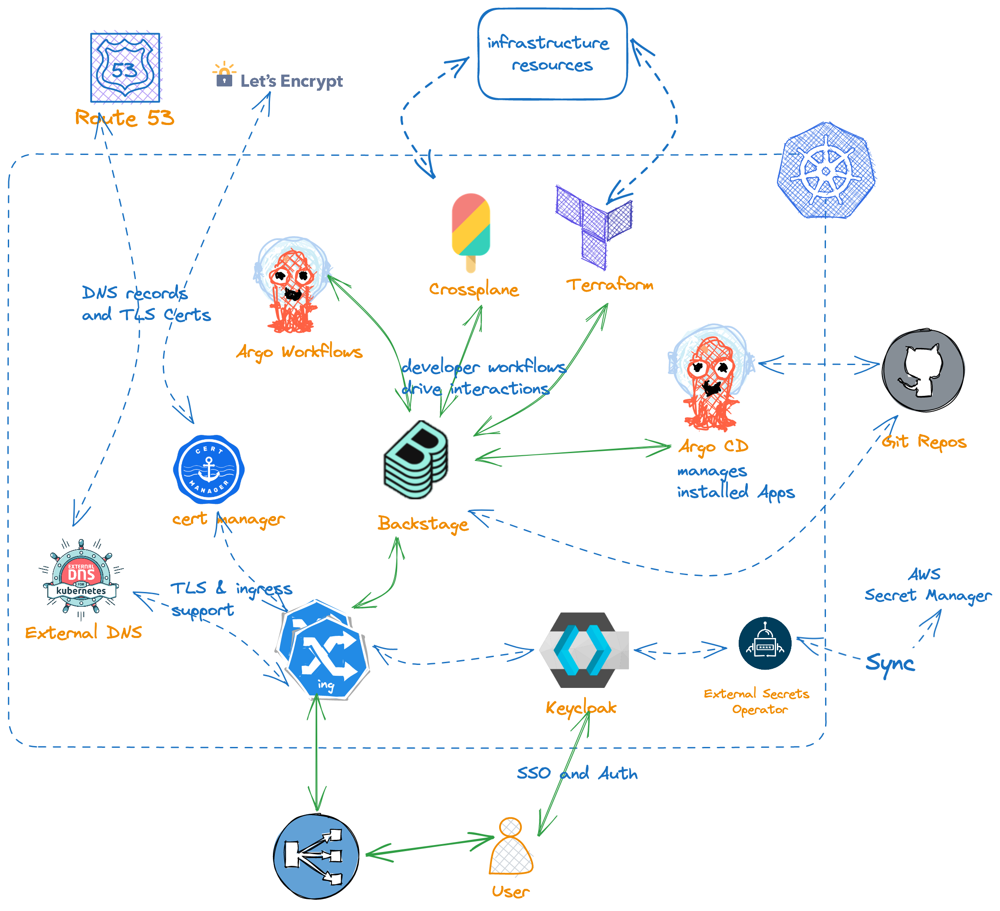

## Notes

Trying to make anything under the /packages directory usable as is. This means certain configuration options like domain name must be passed outside of this directory. e.g. use ArgoCD helm params.
This is because I don't want to require end users to fork this repository and push commits many times.

We could probably deploy everything as a ArgoCD's app of apps with syc wave and what not.

## Secret handling. 

Currently handled outside of repository and set via bash script. 

We could use sealed secrets too.


## Requirements

- Github ORGANIZATION
- An existing k8s cluster
- AWS CLI
- Kubectl CLI
- jq
- npx

## Things created outside of the cluster with SSO enabled.

- Route53 records. Route53 hosted zones are not created. You must also register it if you want to be able to access through public DNS. These are managed by the external DNS controller.

- AWS Network Load Balancer. This is just the entrance to the Kubernetes cluster. This points to the default installation of Ingress Nginx and is managed by AWS Load Balancer Controller.

- TLS Certificates issued by Let's Encrypt. These are managed by cert-manager based on values in Ingress. They use the production issuer which means we must be very careful with how many and often we request certificates from them. The uninstall scripts backup certificates to the `private` directory to avoid re-issuing certificates.

These resources are controlled by Kubernetes controllers and thus should be deleted using controllers.

### AWS permissions
Must be able to create roles and policies.

## Creating GitHub Apps for your GitHub Organization

We strongly encourage you to create a dedicated GitHub organization. If you don't have an organization for this purpose, please follow [this link](https://docs.github.com/en/organizations/collaborating-with-groups-in-organizations/creating-a-new-organization-from-scratch) to create one.

There are two ways to create GitHub integration with Backstage. You can use the Backstage CLI, or create it manually. See [this page](https://backstage.io/docs/integrations/github/github-apps) for more information on creating one manually. Once the app is created, place it under the private directory with the name `github-integration.yaml`. 

To create one with the CLI, follow the steps below.

```bash
npx '@backstage/cli' create-github-app ${GITHUB_ORG_NAME}
# If prompted, select all for permissions.
# In the browser window, allow access to all repositories then install the app.

# move it to a "private" location. 
mkdir -p private
GITHUB_APP_FILE=$(ls github-app-* | head -n1)
mv ${GITHUB_APP_FILE} private/github-integration.yaml
```

The file created above contains credentials. Handle it with care.

The rest of the installation process assumes the GitHub app credentials are available at `private/github-integration.yaml`

If you want to delete the GitHUb application, follow [these steps](https://docs.github.com/en/apps/maintaining-github-apps/deleting-a-github-app). 

## Creation Order

### Keycloak SSO with DNS and TLS certificates

If using keycloak SSO with fully automated DNS and certificate management, it must be:

1. aws-load-balancer-controller
2. ingress-nginx
3. cert-manager 
4. external-dns
5. The rest of stuff


### Keycloak SSO with manual DNS and TLS Certificates

If using keycloak SSO but manage DNS records and certificates manually. 

1. aws-load-balancer-controller
2. ingress-nginx
3. The rest of stuff minus cert-manager and external-dns

In this case, you can issue your own certs and provide them as TLS secrets as specified in the `spec.tls[0].secretName` field of Ingress objects.
You can also let NLB or ALB terminate TLS instead using the LB controller. This is not covered currently, but possible.

### No SSO

If no SSO, no particular installation order. Eventual consistency works.


## Possible issues

### Cert-manager
- by default it uses http-01 challenge. If you'd prefer using dns-01, you can update the ingress files. TODO AUTOMATE THIS
- You may get events like `Get "http://<DOMAIN>/.well-known/acme-challenge/09yldI6tVRvtWVPyMfwCwsYdOCEGGVWhmb1PWzXwhXI": dial tcp: lookup <DOMAIN> on 10.100.0.10:53: no such host`. This is due to DNS propagation delay. It may take ~10 minutes.
